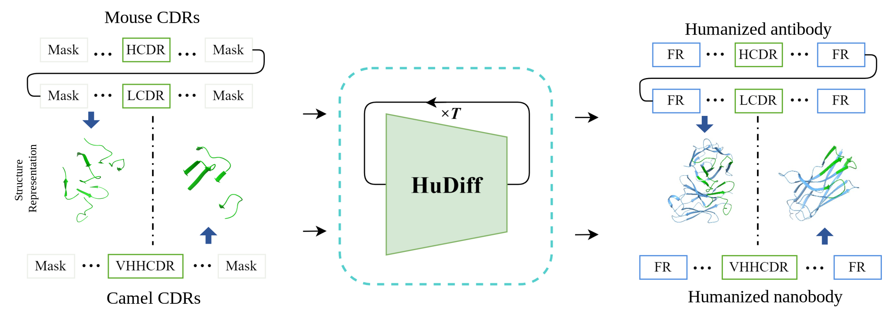

# HuDiff

## Humanization process.



This package offers an implementation of the training details for HuDiff-Ab and HuDiff-Nb, as well as the inference pipeline for both models. Additionally, we provide the following:

1. A fine-tuned antibody humanization diffusion model designed for humanizing mouse antibodies, and a fine-tuned nanobody humanization diffusion model for humanizing nanobodies.
2. The training set we have preprocessed and the test set we constructed in our paper.

Any publication that presents findings derived from using this source code or the model parameters should cite the HuDiff paper. 

For any inquiries, please contact the HuDiff team at fm924507@gmail.com.

## Conda Environment
<!-- We have created a Docker environment available at [mirrors](mirrors.tencent.com/ma_env/antidiff:new). If you prefer to construct the environment yourself, you can use the environment.yaml file to build it. -->
You can use the environment.yaml file to construct the environment.
```
conda env create -f environment.yaml
```

## HuDiff-Ab 
### Data Preparation
We have uploaded the lmdb file of the paired datasets (see [Hugging Face](https://huggingface.co/cloud77/HuDiff/tree/main) for HuDiff), and you can use these datasets directly to train the HuDiff-Ab model. Or you can check the download list we provide.
### Pre-training
```
antibody_scripts/antibody_run.sh
```
Ensure that you modify the environment variables `config_path`, `data_path`, and `log_path` before executing the provided bash script. The `data_path` should be set to the directory path of the provided LMDB files.

### Fine-tuning
```
antibody_scripts/antibody_finetune.sh
```
Ensure that you modify the environment variables `config_path`, `data_path`, `log_path`, and `ckpt_path`. The `ckpt_path` should specify the checkpoint to be fine-tuned. Note that we do not provide the pre-trained checkpoint in our released data, so you will need to train it from scratch. However, we do provide the checkpoints after fine-tuning. The `data_path` remains the same as in the pre-training stage, utilizing the provided LMDB files. 

### Evaluation
Follow these steps to evaluate and execute the provided code for the antibody analysis:
1. Install the required library, OAsis, by cloning its GitHub repository: [BioPhi](https://github.com/Merck/BioPhi)
2. For the patent dataset collected by our lab, run the following command to create samples:
```
python antibody_scripts/sample.py 
--ckpt --ckpt checkpoints/antibody/hudiffab.pt
--data_fpath ./data/antibody_eval_data/HuAb348_data/humanization_pair_data_filter.csv
```
3. Then, evaluate the sample using the following command:
```
python antibody_scripts/patent_eval.py
```
4. For the public 25 pair antibody dataset, execute the following commands:
```
python antibody_scripts/sample.py 
--ckpt --ckpt checkpoints/antibody/hudiffab.pt
--data_fpath ./data/antibody_eval_data/Humab25_data/parental_mouse.csv
```
5. Finally, evaluate the public dataset using the following command:
```
python antibody_scripts/humab25_eval.py
```
For the putative humanization process, although we do not provide the evaluation scripts, you can still follow the same steps outlined above on your own.

### Humanization
There are two ways to humanize an antibody, either by using a complex fasta file containing antigen-antibody sequences or by providing individual heavy and light chain sequences.
```
python antibody_scripts/sample_for_anti_cdr.py 
--ckpt checkpoints/antibody/hudiffab.pt
--anti_complex_fasta data/fasta_file/7k9i.fasta
```
or providing individual heavy and light chain sequences
```
python antibody_scripts/sample_for_anti_cdr.py 
--ckpt checkpoints/antibody/hudiffab.pt
--heavy_seq HEAVY_SEQUENCE 
--light_seq LIGHT_SEQUENCE
```
Keep in mind that you need to replace 7k9i.fasta, HEAVY_SEQUENCE and LIGHT_SEQUENCE with the chain sequences, respectively.


## HuDiff-Nb
### Data Preparation
We have uploaded all LMDB files from the data preprocessing to [Hugging Face](https://huggingface.co/cloud77/HuDiff/tree/main) for HuDiff. If you wish to process the training dataset from scratch, download the heavy chain files (a download list is provided).
### Pre-training
The provided command can be directly executed for training. However, it is essential to specify the environment variables beforehand.
```
nanobody_scripts/nanotrain_run.sh
```
Please note that you need to modify the paths for both the data file (`unpair_data_path`) and the configuration file (`config_path`).
### Fine-tuning
After establishing a pre-trained model, it must be selected for fine-tuning. Modify the YAML configuration file to specify the path to the pre-trained checkpoints. Before fine-tuning, install the [AbNatiV](https://gitlab.developers.cam.ac.uk/ch/sormanni/abnativ) models, and ensure that the AbNatiV models are specified in the configuration YAML file.
```
nanobody_scripts/nanofinetune_run.sh 
```
### Evaluation
This script provides different sampling methods, which can be customized, such as replacing the checkpoint with your trained model.
```
python nanobody_scripts/nanosample.py 
--ckpt checkpoints/nanobody/hudiffnb.pt 
--data_fpath data/nanobody_eval_data/abnativ_select_vhh.csv 
--model pretrain 
--inpaint_sample False
```
```
python nanobody_scripts/nanosample.py 
--ckpt checkpoints/nanobody/hudiffnb.pt 
--data_fpath data/nanobody_eval_data/abnativ_select_vhh.csv 
--model finetune_vh 
--inpaint_sample True
```
After sampling, we can use the following script to evaluate the sampling results.
```
python nanobody_scripts/nano_eval.py  # Need to specific the path of sample.
```
### Humanization
Using the fasta file of the nanobody, our model can humanize it. If you require a higher degree of humanization, consider increasing the batch size or the number of samplings.
```
python nanobody_scripts/sample_for_nano_cdr.py 
--ckpt checkpoints/nanobody/hudiffnb.pt 
--nano_complex_fasta data/fasta_file/7x2l.fasta 
--model finetune_vh 
--inpaint_sample True
```

# Citing HuDiff 
If you use HuDiff in your research, please cite our paper
```BibTex
@article{ma2024adaptive,
  title={An adaptive autoregressive diffusion approach to design active humanized antibody and nanobody},
  author={Ma, Jian and Wu, Fandi and Xu, Tingyang and Xu, Shaoyong and Liu, Wei and Yan, Divin and Bai, Qifeng and Yao, Jianhua},
  journal={bioRxiv},
  year={2024},
  publisher={Cold Spring Harbor Laboratory}
}
```